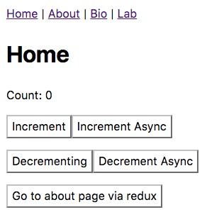

# Create-React-App Plus: Redux, React Router 4 & Redux Thunk

This start kit is based on one created by Jamie Barton [link](https://medium.com/@notrab/getting-started-with-create-react-app-redux-react-router-redux-thunk-d6a19259f71f)

This is mainly for my own use at this point, so please forgive any rough spots or unexplained details

## Features
* Zero config
* Serve/watch/hot updates all from a single command:

`npm start`

* Simple file structure, at least for now
* Simple enough to easily see how the routing and redux'ing work

## Differences from react-start2

* Better file structure ("scenes" folder)
* Adds bootstrap-react

## Usage
* Clone it
* Delete the .git folder
* Two commands and BINGO

`npm install`

`npm start`

